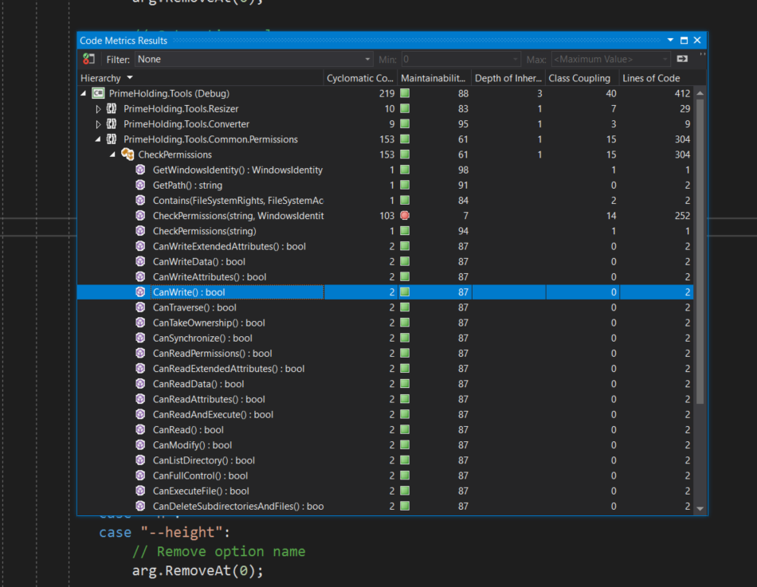
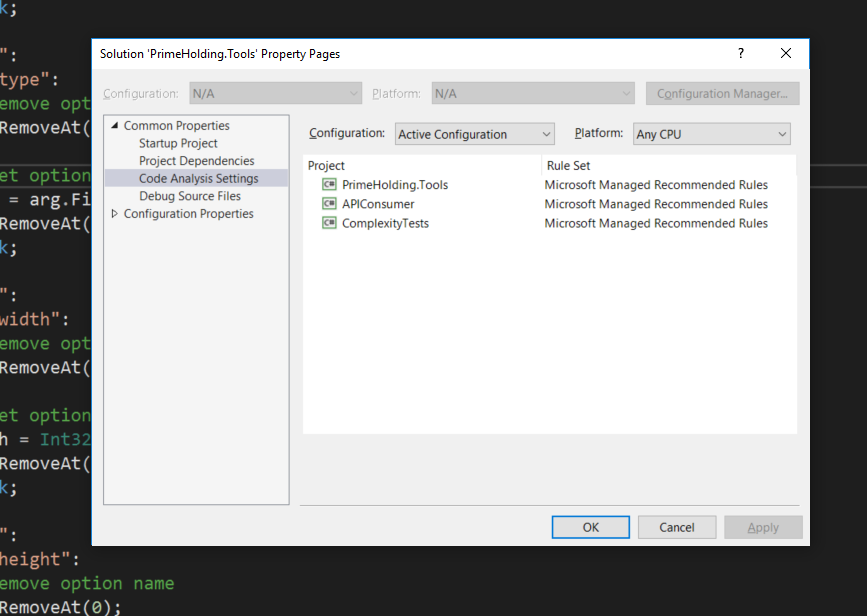

# Съдържание

- Дефиниции
- Пресмятане на цикломатична комплексност
- Пресмятане на NPath комплексност
- Q & A

# Дефиниции

### Метрики на софтуера

- Стандарт за измерване на степента, до която софтуера притежава някаква стойност
- Представляват функции и/или показатели (резултат от прилагането на функциите), често се ползват като синоними
- Най-често се използват при квантитативни измервания
- Основна цел на прилагането им:
    - Получаване на обективни измервания (метрики) на кода
    - Получаване на възпроизведими метрики
    - Получаване на количествено измерими метрики
- Приложение:
    - Budget planning
    - Cost estimation
    - QA / Testing
    - Performance optimization
    - Оптимално изпълнение на задачите (в рамките на екип, проект, организация и т.н.)

<br>

### Често използвани софтуерни метрики

<br>

- Брой bugs за ред код (bugs per line of code)
- Code coverage
- Кохезия (Cohesion)
- Плътност на коментарите (Comment density)
- Зависимост (Coupling / Dependency)
- Цикломатична комплексност
- Брой редове на изходния код
- Брой на класове и интерфейси
- Време за изпълнение на програмата

<br>

# Цикломатична комплексност

### Дефиниция

- Софтуерна метрика използвана за определяне сложността на програмата
- Още е известна и като комплексност на МакКейб
- Квантитативна мярка за броя линейно независими пътища за изпълнение на изходния код
- За изходен код, който не съдържа control flow statements - цикломатичната сложност е 1
- При добавяне на прост **if-else** оператор комплексността нараства на 2, за вложен **if** оператор с две условия - 3 и т.н.
- Цикломатичната комплексност се пресмята, чрез т.нар. control flow graph на програмата (частта от кода, която се оценява)
- Пресмятането става по формулата: **M = E - N + 2P**, където:
    - **М** - Цикломатичната комплексност
    - **Е** - Броя на ребрата в графа
    - **N** - Броя на върховете в графа
    - **P** - Броя на свързаните компоненти в графа
- При оценяване на семпла програма (single program) (или отделен метод), стойността на P е 1 - тогава може да използваме формулата **M = E - N + 2**

<br>

### Пример:

<br>


<br>

- Изпълнението на програмата започва от върха оцветен в червено
- Първата група от три върха представлява циклична конструкция
- Втората група от три върха представлява conditional statement
- Изпълнението на програмата завършва във върха оцветен в синьо
- Така представената програма има:
    - 9 ребра
    - 8 върха
    - 1 свързан компонент (цикличната конструкция, всеки връх е свързан с другите)
- Цикломатичната комплексност е 9 - 8 + 2 * 1 = 3 (замествайки във формулата представена по-горе)

<br>

### Допустими стойности за цикломатична комплексност:

<br>

- 1 до 10 - Нормална цикломатична комплексност - не представлява риск
- 11 до 20 - Средна цикломатична комплексност - нисък риск
- 21 до 50 - Висока цикломатична комплекснотс - среден риск, индикация за рефакторинг
- над 50 - Много висока цикломатична комплексност - висок риск, затруднява тестването и поддържането на кода, задължителен рефакторинг

<br>

### Анализ на изходния код с инструменти на Visual Studio

<br>

- От меню **Analyze** избираме **Run code analysis**
- По избор може да стартирате анализ за всички проекти в solution-а или само за избран проект (при multi-project solutions)



- Правилата за анализ могат да се настройват както за solution-а, така и за избран проект



- Създаване на собствени правила за анализ - [https://andrewlock.net/creating-a-roslyn-analyzer-in-visual-studio-2017/](https://andrewlock.net/creating-a-roslyn-analyzer-in-visual-studio-2017/)

<br>

# NPath комплексност

### Дефиниция

<br>

- NPath е метрика, която измерва сложността на изпълнение на базата на графи
- NPath комплексността е броя ациклични пътища (варианти) за изпълнение на функция, модул, метод, клас и/или програма
- Ацикличен път на изпълнение е вариант за изпълнение на програмен код, който не включва циклична структура 
- NPath комплексността има отношение към максималния брой тестове необходими за Code Coverage

<br>

### Пример:

<br>

```csharp
static double Add(double num1, double num2)
{
    if (Double.IsNaN(num1))
    {
        num1 = 0;
    }

    if (Double.IsNaN(num2))
    {
        num2 = 0;
    }

    return num1 + num2;
}
```

<br>

В тази функция идентифицираме следните пътища (варианти) за изпълнение:

<br>

- Аргумента **num1** не е число, но **num2** е число
- Аргумента **num2** не е число, но **num1** е число
- Двата аргумента не са числа
- Двата аргумента са числа

<br>

Следователно NPath комлпексността е **4**

<br>

### Оптимизиране на примера

<br>

- За да подобрим тестваемостта на функцията трябва да намалим NPath комплексността
- За целта може да разделим метода на малки части
- Постигаме желания резултат, чрез следния рефакторинг:

<br>

```csharp
static double CheckNumber(double num)
{
    if (Double.IsNaN(num))
    {
        return 0;
    }

    return num;
}

static double AddOptimized(double num1, double num2)
{
    return CheckNumber(num1) + CheckNumber(num2);
}
```

<br>

- В посочения по-горе пример NPath комплексността е намалена, както следва:
    - Метода CheckNumber() има NPath комплексност със стойност 2
    - Метода Add() има NPath комплексност със стойност 1

<br>

# Допълнителни инструменти

- [Code Map](https://docs.microsoft.com/en-us/visualstudio/modeling/map-dependencies-across-your-solutions?view=vs-2017): Visual Studio Enterprise component;
- [Code Graph](https://marketplace.visualstudio.com/items?itemName=YaobinOuyang.CodeAtlas): Visual Studio Extension;
- [Quick Diagram Tool for C#](https://marketplace.visualstudio.com/items?itemName=FerencVizkeleti.QuickDiagramToolforC#overview): Visual Studio Extension;
- [Visustin v8 Flow chart generator](http://www.aivosto.com/download.html) - Free trial;


# Задачи за самостоятелна работа

- Стартирайте Code analysis за избран от вас проект или използвайте примерния код
- Анализирайте резултатите за Цикломатичната комплексност на кода
- Идентифицирайте потенциални проблемни части на кода и планирайте промени за оптимизиране
- Направете анализ на NPath комплексността и идентифицирайте потенциални проблеми места в кода
