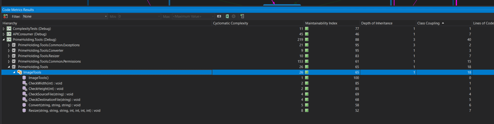

# Съдържание

- Въведение
- Цикломатична комплекност (Cyclomatic complexity)
- Брой линии изходен код (Lines of source code)
- Свързаност между класовете (Class coupling)
- Степен на наследяване (Depth of Inheritance)
- Индекс за поддържане (Maintainability Index)

# Въведение

### Взаимодействие между различните метрики

<br>


<br>

### Предимства при анализ на софтуерните метрики

<br>

- Подобрява се поддържаемостта на кода
- Намалява риска при разширяване / добавяне на функционалност
- Подобрява се сигурността при изпълнеие

<br>

### Цели

<br>

- Как се тълкуват метриките
- По какво се различават една от друга
- Кои са минимални, максимални и оптимални стойности
- Как се калкулират стойностите
- Как да се оптимизира кода

<br>

# Брой редове изходен код (Line of source code / SLOC / LOC)

### Дефиниция

<br>

- Представлява броя редове изходен код
- Видове LOC:
	- LOC (Line of code) - брой редове във файла, съдържащи програмен код
    - LLOC (Logical Lines Of Code) - брой редове логически изпълним код (без коментари и празни редове)
    - SLOC (Source Lines Of Code) - брой редове изходен код (програмен код + коментари + многоредови символни низове)
    - CLOC (Comments Lines of Code) - брой редове, съдържащи само коментари 
    - MLOC (Multiline string Line Of Code) - брой редове, съдържащи многоредови символни низове
    - BLOC (Blank Lines Of Code) - брой "празни" редове, съдържащи whitespace символи (интервал, таблуватор, нов ред и др.)
- Пример:

<br>

```csharp
for (int x = 0; x <= 100; x++) Console.WriteLine("X = {0}", x); // Колко реда код има в тази проста програма?
```

<br>

```csharp
for (int x = 0; x <= 100; x++)
{
	Console.WriteLine("X = {0}", x);

	// Колко реда код има в тази проста програма?
}
```

<br>

За примерите по-горе, дължината (броя редове) е както следва:

<br>

- Пример 1:
    - LOC - 1 ред
    - LLOC - 2 реда - един за for() и един за WriteLine()
    - CLOC - 1 ред
    - SLOC - 1 ред
- Пример 2:
    - LOC - 6 реда 
    - LLOC - 2 реда
    - CLOC - 1 ред
    - SLOC - 5 реда - един за for() и WriteLine(), два за фигурните скоби, един за коментара
    - BLOC - 1 ред

<br>

### Общи препоръки

<br>

- Rule of thumb: Старайте се методите ви да имат възможно най-малък брой редове код
- Препоръчителни стойности за SLOC: 
    - Минимална - 4 реда за метод, 8 за файл (минимум 1 метод във файл + namespace и дефиниция на клас)
    - Максимална - според ограниченията на файловата система
    - Препоръчителна - 40 реда за метод, 400 за файл (максимум 10 метода във файл)
- Превишаване на препоръчителната стойност е индикация за нарушвение на Single Resposibility Pattern
- По-дългите методи / файлове са кандидати за refactoring
- В определени случаи се допуска отклонение, ако проекта го изисква

<br>

# Свързаност между класовете (Class Coupling)

### Дефиниция

<br>

- Измерва зависмостите на клас от други класове / типове
- За всяко ниво на зависимост (абстракция) включва брой класове / типове, от които зависи конкретния клас
- В броя не се включват примитивни и built-in типове 
- По-висока стойност е индикация за по-висока сложност (на приложение, абстракция, архитектура и др.)

<br>

### Пример

<br>



<br>

### Общи препоръки

<br>

- Старайте се класовете ви да имат минимални зависимости помежду си
- Старайте се да не използвате твърде много (според целите на проекта и/или екипа) библиотеки / frameworks
- Използвайте Class диаграми за проследяване на връзките между класовете


- Използвайте CodeMap диаграми за идентифициране на висок брой зависимости


<br>


<br>

# Степен на наследяване (Depth of Inheritance)

### Дефиниция

<br>

- Тази метрика показва позицията на класа в класовата йерархия
- Всички класове са директни производни на System.Object
- Стойността по подразбиране е 1 за всички класове
- Имплементираните интерфейси не се отчитат при калкулиране на стойностите

<br>

### Пример

<br>

```csharp
namespace Examples
{
    public interface IBase
    {

    }

    public abstract class BaseClass : IBase
    {
    }

    public class ChildClass : BaseClass
    {

    }

    public class GrandChildClass : ChildClass
    {

    }
}
```

<br>


<br>


<br>

### Общи препоръки

<br>

- Препоручва се да поддържате минимална степен на наследяване
- Минимална стойност - 1
- Максимална стойност - няма, според сложността и обема на проекта
- Препоръчителна стойност - под 4 

<br>

# Индекс за поддържане (Maintainability Index)

### Дефиниция

<br>

- Комплексна метрика, която измерва усилията за поддържане на кода като качествен показател
- Приема стойности от 0 до 100, като по-висока стойност означава по-лесно поддържане на кода
- Стойността на индекса е базирана на следните метрики:
    - Цикломатична комплексност
    - Брой редове код
    - Обем на Халстед
- Пресмята се по формулата (във VisualStudio) **Maintainability Index =  MAX(0,(171 – 5.2 * ln(Halstead Volume) – 0.23 * (Cyclomatic Complexity) – 16.2 * ln(Lines of Code)) * 100 / 171)**
- Обем на Халстед се пресмята от следните метрики:
    - Дължина на програмата **N**, пресмята се по формулата **N = N1 + N2**
    - Дължина на речника **n**, пресмята се по формулата **n = n1 + n2**
    - Обем на Халстед се пресмята по формулата **V = N * log2(n)**
    - Обема на една програма трябва да бъде между 20 и 1000
    - Стойности над 1000 са индикация за рафекторинг (метода изпълнява повече от едно действие)
    - Обема на един файл трябва да бъде между 100 и 8000
- Дължина на програмата **N**, включва:
    - Сумата от броя на операторите **N1**
    - Сумата от броя на операндите **N2**
- Дължина на речника **n**, включва:
    - Сумата от броя на различните (уникални) оператори **n1**
    - Сумата от броя на различните (уникални) операнди **n2**

<br>

### Пример

<br>


<br>

### Общи препоръки

<br>

- Тълкуване на резултатите:
    - Стойности от 0 до 9 - нисък индекс за поддържане на кода
    - Стойности от 10 до 20 - среден индекс за поддържане на кода
    - Стойности от 21 до 100 - висок индекс за поддържане на кода
- Стойности под 21 са индикация за рефакторинг, ако е приложимо
- Полезни инструменти:
    - [Microsoft CodeLens Code Health Indicator](https://marketplace.visualstudio.com/items?itemName=Jean-MarcPrieur.MicrosoftCodeLensCodeHealthIndicator-15077)
    - [CodeMetric for Visual Studio](https://marketplace.visualstudio.com/items?itemName=JeffChenCodingConsultantCo.CodeMetricforVisualStudio)
<br>

# Задачи за самостоятелна работа

- Стартирайте Code analysis за избран от вас проект или използвайте примерния код
- Анализирайте всички резултати от инструментите на Visual Studio
- Идентифицирайте потенциални проблемни части на кода и планирайте промени за оптимизиране
- Направете анализ на получените стойности и идентифицирайте потенциални проблеми места в кода