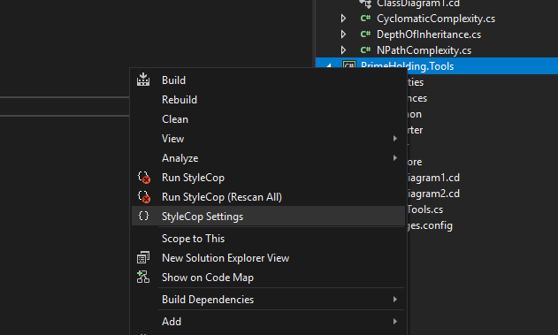

# Съдържание

- Въведение
- Предимства при автоматизиране
- Инсталиране и конфигуриране на StyleCop
- Инсталиране и конфигуриране на FxCop
- Q & A

# Въведение

### Какво е "coding standard"?

<br>

- Набор от правила или указания при създаване на изходен код
- Определят следните аспекти:
    - Безопасност на кода - избягва се въвеждане (създаване) на грешки в прогмния код
    - Стил (на композиция) - улеснява поддържаемостта на кода
    - Сигурност - улеснява избягването на пропуск в сигурността
    - Ефикасност - увеличава прозиводителността на приложението
- Стандартите могат да бъдат прилагани, като:
    - Препоръки
    - Code reviews

<br>

### Пример

- Може да използваме Bubble Sort или Quick Sort за сортиране на данни
- Bubble sort има сложност О(n2), докато Quick sort - O(n * log(n))
- Ако примем, че трябва да сортираме 1 милион елемента и всяка проверка отнема 1 микросекунда - тогава:
    - Bubble sort ще се изпълни за 11 дни
    - Quick sort ще се изпълни за 19 секунди
- Двата алгоритъма сортират данни, но единия определено е по-полезен

<br>

### Прилагане на стандарти при създаване на код

<br>

- Стандарти трябва да се прилагат, за да гарантират сигурност, надежност и производителност
- Прилагането на стандарти гарантира качество на кода (според нивото на приложения стандарт)
- Автоматизирането на процеса улеснява и повишава качеството при разработване

<br>

# Предимства при автоматизиране

- Стандартите се прилагат обективно понеже се анализра само изходен код или компилиран assembly
- Процеса се изпълнява по-бързо и по-прецизно, ако се прилагат ръчно
- Програмистите (авторите на кода) не се чувстват персонално засегнати
- Спестява време при code reviews
- Спестя време на разработчиците, понеже преглед на кода (code review) изисква по-малко време и итерации
- Различните аспекти (source code, assemblies) се анализират с различни инструменти

<br>

# Инсталиране и конфигуриране на StyleCop

### Инсталиране

<br>

- [Visual Studio Plugin](https://marketplace.visualstudio.com/items?itemName=ChrisDahlberg.StyleCop)
- [MSBuild NuGet пакет](https://www.nuget.org/packages/StyleCop.MSBuild)

<br>

### Предимства на StyleCop

<br>

- Анализира изходен код, но не и компилиран код
- Подходящ за проверка на елементи, като:
    - Spacing
    - Коментари
    - Композиция на файлове
    - Конвенции за именуване
- Затруднена е проверката на типови йерархии и програмна структура

<br>

### Конфигуриране на StyleCop

<br>

- За инстанцията на VisualStudio - %LocalAppData%\Microsoft\VisualStudio\15.0_80ca61a3\Extensions\awmorobh.u0c (за всяка инстанция версията ще е различна)
- За конкретен проект - Settings.StyleCop в директорията на проекта
- За конкретен файл - може да се избира дали да се включва / изключва от анализ
- За конкретна част (блок) от кода - може да се избира дали да се включва / изключва от анализ

<br>

### Промяна на конфигурацията

<br>

- За конкретен проект (стандартни настройки)

<br>


<br>


<br>

- Редактиране на настройките с графичен инструмент

<br>



<br>


<br>

- Изключване на конкретен файл от анализ

<br>


<br>

- Изключване на анализ за конкретен блок от код (само за определено правило)

<br>

```csharp
public void Convert(String sourceFile, String destinationFile, String Type)
{
    switch (Type.ToLower())
    {
        case "jpg":
        case "jpeg":
            converter = new ConverterContext(new Jpeg());
            break;

        case "gif":
            converter = new ConverterContext(new Gif());
            break;

        case "png":
            converter = new ConverterContext(new Png());
            break;

        default:
		#pragma warning disable CS0162 // Unreachable code detected
            throw new ImageFormatException();
            break;
		#pragma warning restore CS0162 // Unreachable code detected
    }
    
    // Check source file for read access
    CheckSourceFile(sourceFile);

    // Check destination file for write access
    CheckDestinationFile(destinationFile);

    Image sourceImage = Image.FromFile(sourceFile);
    converter.ConvertImage(sourceImage, destinationFile);
    sourceImage.Dispose();
}
```

<br>


<br>

```csharp
public void Convert(String sourceFile, String destinationFile, String Type)
{
    switch (Type.ToLower())
    {
        case "jpg":
        case "jpeg":
            converter = new ConverterContext(new Jpeg());
            break;

        case "gif":
            converter = new ConverterContext(new Gif());
            break;

        case "png":
		#pragma warning disable SA1101
            converter = new ConverterContext(new Png());
		#pragma warning restore SA1101
            break;

        default:
		#pragma warning disable CS0162 // Unreachable code detected
            throw new ImageFormatException();
            break;
		#pragma warning restore CS0162 // Unreachable code detected
    }
    
    // Check source file for read access
    CheckSourceFile(sourceFile);

    // Check destination file for write access
    CheckDestinationFile(destinationFile);

    Image sourceImage = Image.FromFile(sourceFile);
    converter.ConvertImage(sourceImage, destinationFile);
    sourceImage.Dispose();
}
```

<br>


<br>

# Инсталиране и конфигуриране на FxCop (Roslyn Analyzerz)

### Инсталиране 

<br>

- Инсталиране на NuGet [пакет](https://www.nuget.org/packages/Microsoft.CodeAnalysis.FxCopAnalyzers), или
- Инсталиране на Visual Studio [plugin](https://marketplace.visualstudio.com/items?itemName=VisualStudioPlatformTeam.MicrosoftCodeAnalysis2017)

<br>

### Конфигуриране 

<br>

- Разрешаване / Забраняване на автоматичен анализ на кода

1.  Десен клик в Solution Explorer и избираме Properties, за проекта за който искаме да направим промяна

2. Избираме Code Analysis от настройките на проекта

3. Указваме типа при build в Configuration и целевата платформа в Platform

4. За да разрешим или забраним автоматичния анализ избираме или премахваме checkmark-а "Enable Code Analysis" за Build checkbox-а

<br>

- Разрешаване / Забраняване на "full solution" анализ

1. От лентата с менюто във Visual Studio избираме Tools > Options

2. В диалоговия прозорец за "Options" dialog box избираме Text Editor > C# > Advanced

3. Избираме или премахваме "Enable full solution analysis" checkbox-a. Избираме OK, когато сме готови

<br>

### Подтискане на правила за FxCop (Roslyn analyzers)

<br>

- Глобално - създава се файл с име GlobalSuppressions.cs, където се описват всички съобщения

<br>

```csharp
// This file is used by Code Analysis to maintain SuppressMessage 
// attributes that are applied to this project.
// Project-level suppressions either have no target or are given 
// a specific target and scoped to a namespace, type, member, etc.

[assembly: System.Diagnostics.CodeAnalysis.SuppressMessage("Documentation", "CA1200:Avoid using cref tags with a prefix", Justification = "<Pending>", Scope = "type", Target = "~T:PrimeHolding.Tools.Common.Exceptions.FileNotFoundException")]

```

<br>

- Локално - за конкретен блок от код, калс, метод, файл и др.

<br>

```csharp
namespace PrimeHolding.Tools.Common.Exceptions
{
    using System;

#pragma warning disable CA1200
    ///////////////////////////////////////////////////////////////////////////////////////////////
    /// <summary>
    ///     (Serializable) exception for signalling file not readable errors. This class cannot be
    ///     inherited.
    /// </summary>
    ///
    /// <seealso cref="T:PrimeHolding.Tools.Common.Exceptions.GenericException"/>
    ///////////////////////////////////////////////////////////////////////////////////////////////
#pragma warning restore CA1200

	...
}
```

<br>

- За Generated code

<br>

1. Десен клик в Solution Explorer и избираме Properties, за проекта за който искаме да включим подтискането

2. Избираме Code Analysis от настройките на проекта

3. Активираме "Suppress results from generated code" checkbox-а

<br>


# Общи препоръки

<br>

- Rule of thumb: Избягвайте изключване на файл или група от файлове от анализа на StyleCop при често срещани отклонения
- По-добре да се ползват правила, които се отнасят до 90-95% от кода и да се подтискат за one-off изключения
- Ако code reviewer-а не е съгласен с подтискането на съобщенията - това може да се дискутира
- Изключването на конкретно правило (група от правила) трябва да се прави - единствено и само, когато се налага

<br>

# Задачи за самостоятелна работа

- Стартирайте анализ за избран от вас проект или използвайте примерния код
- Анализирайте всички резултати от инструмента 
- Идентифицирайте потенциални проблемни части на кода и планирайте промени за оптимизиране
- Планирайте рефакторинг на одобрените промени