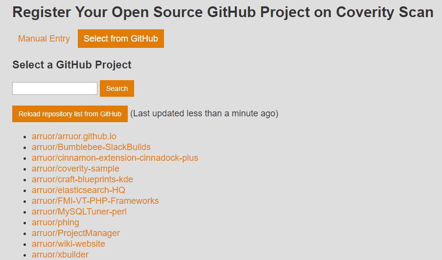
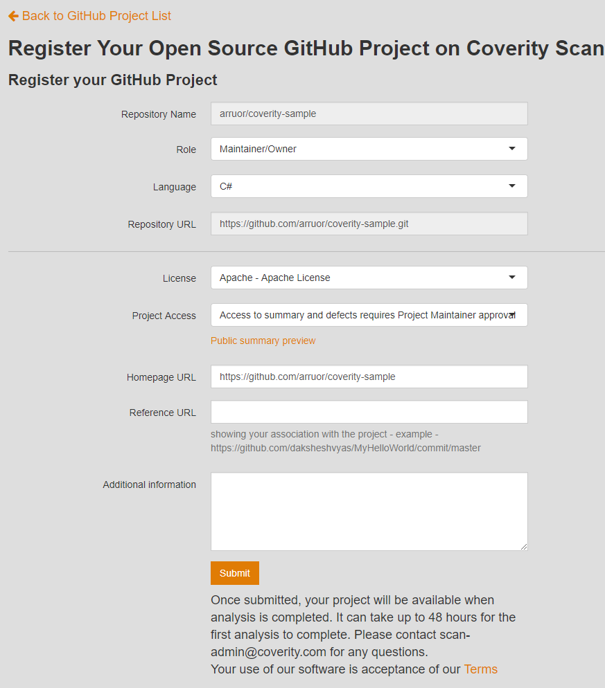
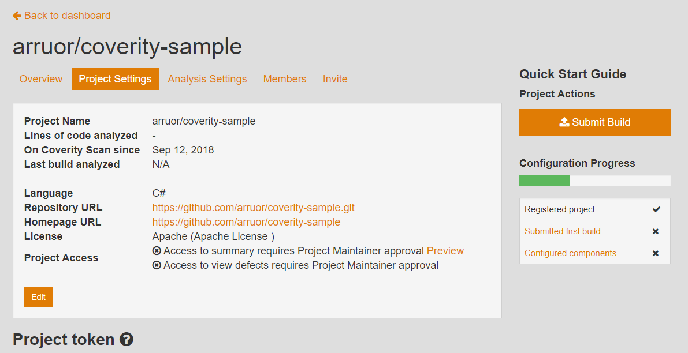
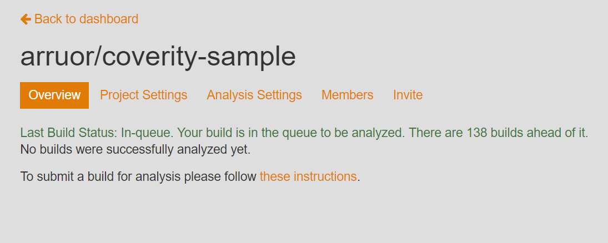
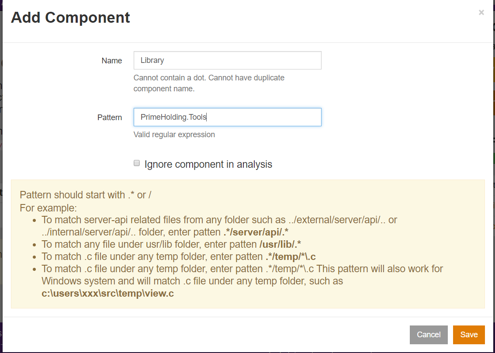

# Съдържание

- Въведение
- Регистрация и конфигуриране на проект
- Конфигуриране на услугата
- Тълкуване на резултата
- Q & A

# Въведение

- Coverity Scan e уеб базирана услуга за статичен анализ на програмен код
- Има интеграция с Github и Travis CI
- Поддържа различни нива на статичен анализ
    - Compiler warnings - проверява дали програмата е type safe
    - Byte code анализ - идентифицира дефекти в intermediate код
    - Source code анализ - генерира възможно най-точни резултати

 

### Видове грешки (пропуски) разпознавани от Coverity Scan

 

- Resource leaks 
    - Database connection leaks
    - Resource leaks
    - Socker & Stream leaks
- Грешки при ползване на API 
    - Използване на вече освободени ресурси
- Null pointer dereferences
    - Dereferences след проверка за null стойности
    - Dereferences преди проверка за null стойности
    - Dereferences при връщане на null стойности
- Проблеми при контролни конструкции (control flow)
    - Допълнителен символ ';' (best hide'n'seek champion since 1985 ;->)
    - Сравнение на несъвместими типове
    - Използване на '=' вместо '=='
- Подозрителен код
    - Copy / Paste грешки
    - Значителни аномалии при indentation
    - Разменени аргументи
- и други

 

# Регистрирация и конфигуриране на услугата

### Регистрация

 

- Регистрация на standalone акаунт
- Регистрация с Github акаунт (препоръчително)

 

### Създаване на проект

 

- ИЗбираме бутон "Add a New Project"

 

 

- Избираме бутон "Reload repo list from GitHub"
- Избираме името на хранилището от GitHub, което съдържа изходния код на проекта за анализ 

 

 

- Добавяме мета данни за проекта - Роля, Програмен език, Тип на лиценза и др.

 

 

 

- Избираме бутон "Submit build"
- По желание може да добавим интеграция с Travis CI 

 

 

- Добавяме мета данни за build-а
    - Версия на проекта
    - Описание на проекта
    - Път до архива съдържащ сурови данни от Coverity Scan Self-Build инструмента
- Инсталиране на Coverity Scan Self-Build инструмента и използване
    - Инсталационен дистрибутив - [Win64, C#](https://scan.coverity.com/download/csharp/win64), [Win32, C#](https://scan.coverity.com/download/csharp/win32)
    - Разархивираме в директория по избор
    - Добавяме bin/ директорията на инстримента към **PATH** променливата
    - В директорията на проекта изпълняваме cov-build --dir cov-int msbuild /t:Rebuild
    - Архивираме междинната директория (в примера с име cov-int)

 

 

- Преглед на статуса за новодобавения build

 

 

- Избираме линк "Configured Components" от страницата с информация за проекта (по желание)
- Добавяме необходимите компоненти за multi-project solution, ако е необходимо

 

 

- Резултатите са достъпни след 1-2 работни дни

 

# Задачи за самостоятелна работа

- Конфигурирайте работното обркъжение за анализ на изходния код
- Стартирайте анализ за избран от вас проект или използвайте примерния код
- Анализирайте всички резултати от инструмента 
- Идентифицирайте потенциални проблемни части на кода и планирайте промени за оптимизиране
- Планирайте рефакторинг на одобрените промени